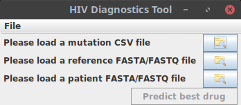
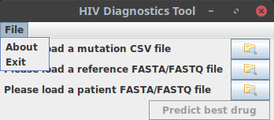

# Aufgabe zu Woche 6

In dieser Woche implementieren Sie die Vorhersage des am besten geeigneten Medikaments sowie die Grundzüge des GUI.

## Vorhersage des am besten geeigneten Medikaments

Auf Basis der eingelesenen Daten können Sie nun ermitteln, gegen welche Medikamente resistente Virusvarianten in der Patientenprobe vorhanden sind.

Dafür kann es unterschiedliche Herangehensweisen geben. Klar ist aber, dass in allen Fällen eine Liste von Resistenzleveln für die unterschiedlichen Medikamente berechnet werden muss (also eine Zuordnung Medikamentenname - Grad der Resistenz, wie in der CSV-Datei gespeichert) und daraus ableitend eine Medikamentenempfehlung gegeben werden muss. 

### SequenceAnalysis

Implementieren Sie entsprechend zunächst eine abstrakte Klasse ```SequenceAnalysis``` mit den folgenden Methoden:

* ```public SequenceAnalysis(String reference, SequenceFile sequences, MutationFile mutations)```: Constructor, der die für die Berechnung relevanten Informationen entgegennimmt. 
* ```public abstract void calculateResistances()```: Eine abstrakte Methode für die tatsächliche Berechnung der vorhergesagten Resistenzen. Diese Methode ist abstrakt, weil die konkrete Implementation je nach verwendeter Methode unterschiedlich sein kann.
* ```public HashMap<String, Double> getResistances()```: Gibt die berechneten vorhergesagten Resistenzen zurück. Falls die Resistenzen noch nicht berechnet wurden, führt diese Methode zuallererst die Berechnung durch. 
* ```public String getBestDrug()```: Gibt den Namen des empfohlenen Medikaments zurück. Es ist immer das Medikament, welches die niedrigste vorhergesagte Resistenz hat. Haben mehrere Medikamente die niedrigste Resistenz (z.B. wenn gar keine resistenten Sequenzvarianten gefunden wurden und die vorhergesagte Resistenz für alle Medikamente entsprechend 0 ist) wird irgendeins der Medikamente mit der niedrigsten Resistenz zurückgegeben. Falls die Resistenzen noch nicht berechnet wurden, führt diese Methode zuallererst die Berechnung durch. 
* ```public String getDrugDescriptions()```: Listet die vorhergesagten Resistenzen in Textform auf (z.B. zeilenweise "Medikamentenname: Vorhergesagte Resistenz"). Falls die Resistenzen noch nicht berechnet wurden, führt diese Methode zuallererst die Berechnung durch.

### FullLengthSequenceAnalysis

Eine Variante, die Resistenzen vorherzusagen, ist zu überprüfen, ob exakt die mit der Resistenz assoziierte Sequenzen in dem Datensatz vorhanden sind. Es muss also für jede mit einer Resistenz assoziierte Sequenz überprüft werden, ob diese in dem Patientendatensatz vorhanden ist. Falls ja, werden die damit assoziierten Resistenzwerte für alle Medikamente als vorhergesagte Resistenzen gespeichert. Durch eine Sequenzvariante kann sich aber die Medikamentenresistenz nicht verringern - wird also eine weitere Sequenz gefunden, die mit Resistenzen assoziiert ist, dürfen die vorhergesagten Resistenzen nur erhöht, aber auf keinen Fall verringert werden.  

Zunächst müssen Sie dafür aber in der Lage sein, aus der Beschreibung der Mutation (z.B. 90M) und der Referenzsequenz die resistente Virussequenz herzuleiten. Implementieren Sie also 
* In ```Mutation``` eine Methode ```public String getSequence(String reference)```, die die von der Mutation vorhergesagte Veränderung der Referenzsequenz zurückgibt. Ist die Mutation beispielsweise ```2A,4Y```, sollte ```getSequence("MLKRL"")``` zurückgeben ```MAKYL``` (die 2. Aminosäure wurde durch ein A, die 4. durch ein Y ersetzt). Hinweis: Sie können das Parsen des Mutationsstrings selber implementieren, oder Sie können das Regular Expression-Modul von Java verwenden, insbesondere die Klassen ```Pattern``` sowie ```Matcher``` mit der Methode ```find``` könnten hilfreich sein, eine Beschreibung der Funktionsweise finden Sie z.B. [hier](https://www.tutorialspoint.com/javaregex/javaregex_capturing_groups.htm). 
* In ```SequenceFile``` eine Methode ```public boolean containsSequence(String sequence)```, die true zurückgibt, wenn die übergebene Sequenz in dem SequenceFile vorhanden ist, und sonst false. Dank der Verwendung von ```HashSet``` zum Speichern der Sequenzen in ```SequenceFile``` können Sie das effizient machen, ohne über alle Sequenzen zu iterieren. 

## GUI

Nachdem Sie nun die Resistenzen vorhersagen können, ist es an der Zeit, die Nutzung für nicht-Informatik-affine Personen einfacher zu machen. Dafür implementieren Sie die ersten Elemente eines GUI. Das GUI soll angezeigt werden, falls das Programm ohne irgendwelche Argumente aufgerufen wird, wie es z.B. bei einem Start durch Doppelklick auf das Programmsymbol der Fall wäre - passen Sie die ```main``` in ```HIVDiagnostics``` entsprechend an.

Implementieren Sie zudem eine Klasse ```HIVDiagnosticsGUI``` in dem package ```org.htw.prog2.aufgabe1```, welche von ```JFrame``` ableitet und das folgende Fenster erstellt:



Das Menü "File" soll die zwei Einträge "About" und "Exit" enthalten:



Neben den Grundlagen aus dem Skript benötigen Sie dafür ein ```JMenu``` mit ```JMenuItems``` - die Verwendung finden Sie auf dieser [Dokumentations-Seite von Oracle](https://docs.oracle.com/javase/tutorial/uiswing/components/menu.html#create) beschrieben. Sie können für diesen Teil der Aufgabe alles auf dieser Seite außer dem Bereich "Creating Menus" ignorieren, mit event handling setzen wir uns in der nächsten Woche auseinander.

Für die Bilder auf den Buttons können sie ein ```javax.swing.ImageIcon``` verwenden, welches im Constructor eine png-Datei nimmt. Die im Beispielscreenshot verwendete Datei finden Sie im repository unter resources/folder_explore.png, sie stammt aus dem für offene Software beliebten [silk iconset von famfamfam](http://www.famfamfam.com/lab/icons/silk/). Das ```ImageIcon``` können Sie dann anstelle eines Textes an den Constructor von ```JButton``` übergeben.

Leider sind automatisierte Tests von Java-GUIs, insbesondere in Umgebungen ohne grafisches System wie die ubuntu-Images auf github, fehleranfällig. Um zu vermeiden, dass in der Hälfte der Fälle die Tests bei Ihnen fehlschlagen, verzichte ich bei der GUI auf automatisierte Tests. Ersetzen Sie bitte stattdessen die Datei Bilder/Aufgabe4_screenshot.png durch einen Screenshot Ihrer GUI, dieser erscheint in dieser REAMDE.md dann hier:

